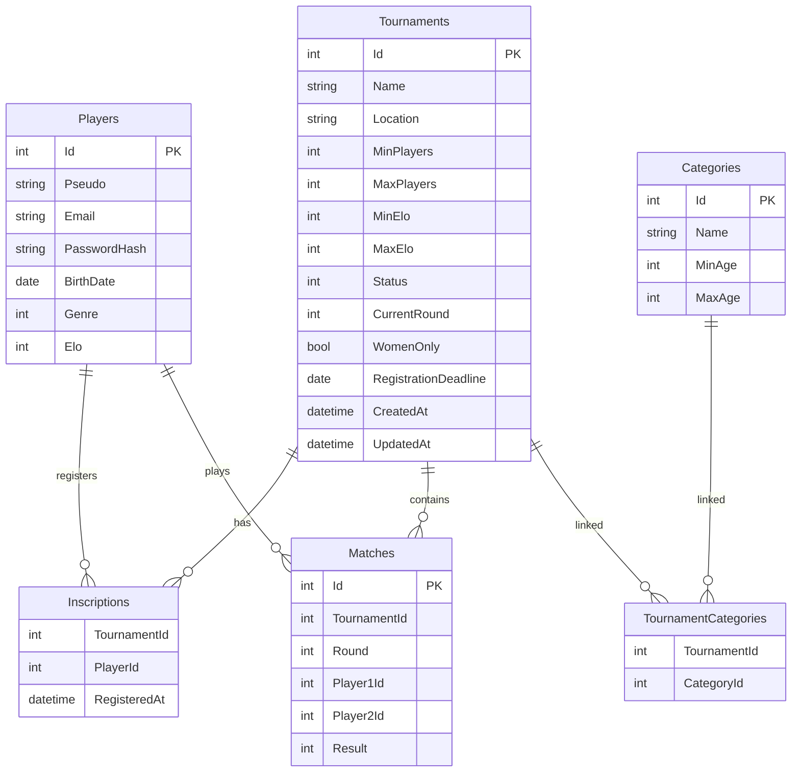

# 🧠 Database Diagram — Chess Tournament API

Ce diagramme représente la structure de la base de données pour l'application de gestion de tournois d'échecs.

---

## 📊 Diagramme (Mermaid)

```mermaid
erDiagram

    Players {
        int Id PK
        string Pseudo
        string Email
        string PasswordHash
        date BirthDate
        int Genre
        int Elo
    }

    Categories {
        int Id PK
        string Name
        int MinAge
        int MaxAge
    }

    Tournaments {
        int Id PK
        string Name
        string Location
        int MinPlayers
        int MaxPlayers
        int MinElo
        int MaxElo
        int Status
        int CurrentRound
        bool WomenOnly
        date RegistrationDeadline
        datetime CreatedAt
        datetime UpdatedAt
    }

    TournamentCategories {
        int TournamentId
        int CategoryId
    }

    Inscriptions {
        int TournamentId
        int PlayerId
        datetime RegisteredAt
    }

    Matches {
        int Id PK
        int TournamentId
        int Round
        int Player1Id
        int Player2Id
        int Result
    }

    Players ||--o{ Inscriptions : registers
    Tournaments ||--o{ Inscriptions : has

    Tournaments ||--o{ Matches : contains

    Players ||--o{ Matches : plays

    Tournaments ||--o{ TournamentCategories : linked
    Categories ||--o{ TournamentCategories : linked
```