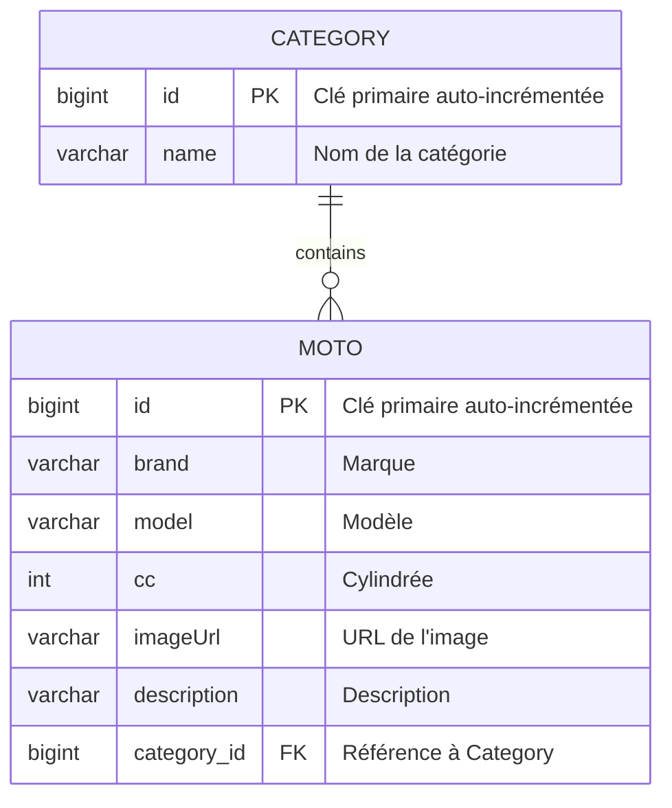
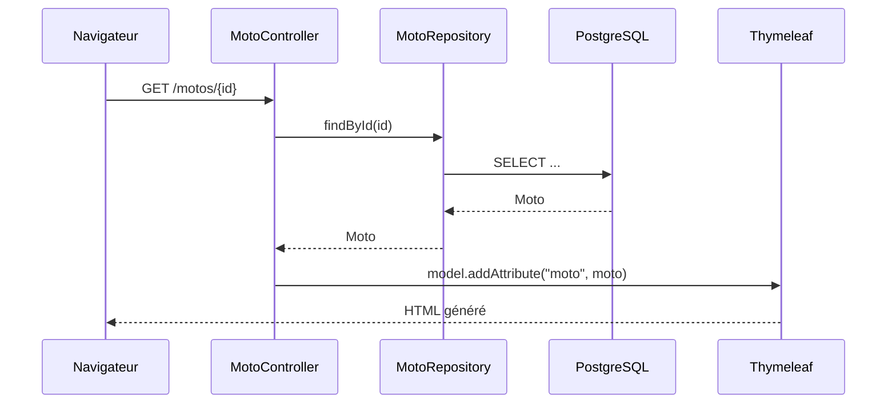

# 🏍️ MotoCrudMVC — Spring MVC avec PostgreSQL

Exercice de formation consacré à la réalisation d'un **CRUD complet en Spring Boot MVC** autour d'un catalogue de motos.

Le projet a d'abord été réalisé avec des données en mémoire (`FakeDb`), puis migré vers une vraie persistance avec **Spring Data JPA, Hibernate et PostgreSQL**.

---

## 🎯 Objectifs d'apprentissage

Ce projet permet de pratiquer :

- ✅ **Spring MVC** : contrôleurs, routes GET / POST et redirections ;
- ✅ **JPA / Hibernate** : mapping des classes Java vers la base de données ;
- ✅ **Repositories** : accès aux données avec Spring Data JPA ;
- ✅ **Relations** : association entre `Moto` et `Category` avec `@ManyToOne` ;
- ✅ **Thymeleaf** : affichage dynamique et formulaires ;
- ✅ **CRUD** : Create, Read, Update et Delete ;
- ✅ **Filtres** : filtrage combiné par marque et catégorie ;
- ✅ **PostgreSQL** : persistance réelle des données ;
- ✅ **Bootstrap** : mise en page simple et responsive ;
- ✅ **Configuration** : utilisation de variables d'environnement pour la connexion à la base.

---

## 🗄️ Architecture de la base de données



Une catégorie peut être associée à plusieurs motos, tandis qu'une moto appartient à une seule catégorie.

### Relation dans `Moto`

```java
@ManyToOne
@JoinColumn(name = "category_id", nullable = false)
private Category category;
```

**Concepts clés :**

- `@Entity` : la classe représente une table en base de données ;
- `@Id` : définit la clé primaire ;
- `@GeneratedValue` : génère automatiquement l'identifiant ;
- `@Column` : configure une colonne ;
- `@ManyToOne` : plusieurs motos peuvent partager une catégorie ;
- `@JoinColumn` : crée la clé étrangère `category_id`.

---

## 🔄 Flux d'une requête Spring MVC



Le contrôleur reçoit la requête, interroge le repository, récupère les données depuis PostgreSQL puis les transmet à la vue Thymeleaf.

---

## 📁 Structure du projet

```text
src/main/java/be/mjodheim/motocrudmvc/
├── controllers/
│   └── MotoController.java
├── entities/
│   ├── Moto.java
│   └── Category.java
├── repositories/
│   ├── MotoRepository.java
│   └── CategoryRepository.java
└── initializers/
    └── Seed.java

src/main/resources/
├── templates/
│   ├── fragments/
│   └── moto/
├── static/css/
└── application.yaml
```

---

## ⚙️ Fonctionnalités

- afficher toutes les motos ;
- afficher le détail d'une moto ;
- ajouter une moto ;
- modifier une moto ;
- supprimer une moto ;
- associer une moto à une catégorie ;
- filtrer les motos par marque ;
- filtrer les motos par catégorie ;
- combiner les deux filtres ;
- initialiser quelques catégories et motos au démarrage avec `CommandLineRunner`.

---

## 🚀 Démarrer le projet

### Prérequis

- Java 25 ;
- Maven ;
- PostgreSQL.

### Variables d'environnement

La connexion à PostgreSQL n'est pas stockée en clair dans `application.yaml`.

Le projet utilise :

```text
DB_URL=jdbc:postgresql://localhost:5432/postgres
DB_USERNAME=postgres
DB_PASSWORD=mot_de_passe
```

`application.yaml` référence ensuite ces variables :

```yaml
spring:
  datasource:
    url: ${DB_URL}
    username: ${DB_USERNAME}
    password: ${DB_PASSWORD}
```

Elles peuvent par exemple être ajoutées dans la configuration de lancement IntelliJ.

### Lancer l'application

```bash
./mvnw spring-boot:run
```

Puis ouvrir :

```text
http://localhost:8080/motos
```

---

## 📚 Concepts retenus

### Repository Pattern

```java
public interface MotoRepository extends JpaRepository<Moto, Long> {
}
```

`JpaRepository` fournit directement les opérations courantes comme `findAll()`, `findById()`, `save()` et `delete()`.

### MVC

```text
Model       → données et entités
View        → templates Thymeleaf
Controller  → traitement des requêtes HTTP
```

L'objectif principal de cet exercice est de comprendre le passage d'un CRUD MVC basé sur des données en mémoire vers une application utilisant une **base PostgreSQL réelle via JPA/Hibernate**.
