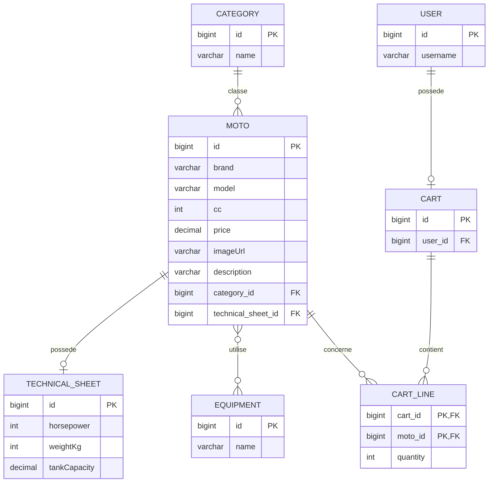
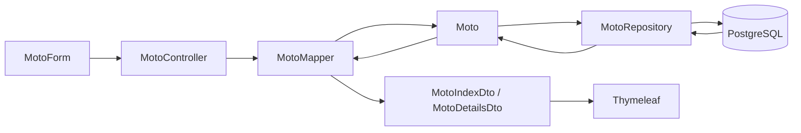

# 🏍️ MotoCrudMVC — Spring MVC, JPA et panier

Projet de formation réalisé avec **Spring Boot MVC**, **Thymeleaf**, **Spring Data JPA**, **Hibernate** et **PostgreSQL** autour d'un catalogue de motos.

Le projet a commencé comme un CRUD simple basé sur des données en mémoire (`FakeDb`), puis a évolué vers une application persistante avec relations JPA, DTO, mappers, validation, filtres et gestion d'un panier.

---

## 🎯 Objectifs d'apprentissage

Ce projet permet de pratiquer :

- **Spring MVC** : contrôleurs, routes GET / POST, redirections et `@ModelAttribute` ;
- **Spring Data JPA / Hibernate** : persistance des entités et requêtes personnalisées ;
- **PostgreSQL** : stockage réel des données ;
- **relations JPA** : `@OneToOne`, `@OneToMany`, `@ManyToOne` et `@ManyToMany` ;
- **clé composite** : `@EmbeddedId` et `@MapsId` pour les lignes du panier ;
- **DTO** : séparation entre les entités JPA et les données utilisées par les vues ;
- **mappers** : conversion entre entités, formulaires et DTO ;
- **validation** : contrôle des données saisies avec Jakarta Validation ;
- **service métier** : gestion des règles du panier dans `CartService` ;
- **Thymeleaf** : affichage dynamique, formulaires et fragments ;
- **Bootstrap** : interface responsive ;
- **filtres combinés** : recherche par marque et catégorie ;
- **variables d'environnement** : configuration de la connexion PostgreSQL.

---

## ⚙️ Fonctionnalités

### Catalogue de motos

- afficher la liste des motos ;
- consulter le détail d'une moto ;
- ajouter une moto ;
- modifier une moto ;
- supprimer une moto ;
- associer une moto à une catégorie ;
- associer une fiche technique à une moto ;
- associer plusieurs équipements à une moto ;
- gérer le prix d'une moto avec `BigDecimal` ;
- filtrer les motos par marque ;
- filtrer les motos par catégorie ;
- combiner les deux filtres.

### Panier

- ajouter une moto au panier ;
- augmenter la quantité d'une ligne déjà présente ;
- diminuer la quantité ;
- supprimer automatiquement une ligne lorsque sa quantité atteint zéro ;
- supprimer directement une ligne ;
- calculer le sous-total de chaque ligne ;
- calculer le montant total du panier ;
- afficher le nombre total d'articles dans la navigation.

L'authentification n'est pas encore intégrée. Pour l'exercice, le panier utilise temporairement l'utilisateur de démonstration ayant l'identifiant `1`.

---

## 🗄️ Modèle de données



### Relations utilisées

| Relation | Implémentation |
| --- | --- |
| `Category` → `Moto` | `@OneToMany` |
| `Moto` → `Category` | `@ManyToOne` |
| `Moto` → `TechnicalSheet` | `@OneToOne` |
| `Moto` ↔ `Equipment` | `@ManyToMany` |
| `User` → `Cart` | `@OneToOne` |
| `Cart` → `CartLine` | `@OneToMany` |
| `CartLine` → `Cart` | `@ManyToOne` + `@MapsId` |
| `CartLine` → `Moto` | `@ManyToOne` + `@MapsId` |

`CartLine` possède une clé primaire composite composée de `cartId` et `motoId`. Une moto ne peut donc apparaître qu'une seule fois dans un panier : lorsqu'elle est ajoutée une nouvelle fois, sa quantité est incrémentée.

Les entités principales héritent également de `BaseEntity`, une classe `@MappedSuperclass` qui centralise les dates de création et de modification.

---

## 🧱 Architecture

```text
src/main/java/be/mjodheim/motocrudmvc/
├── controllers/
│   ├── MotoController.java
│   ├── CartController.java
│   └── GlobalModelAttributes.java
├── entities/
│   ├── BaseEntity.java
│   ├── Moto.java
│   ├── Category.java
│   ├── TechnicalSheet.java
│   ├── Equipment.java
│   ├── User.java
│   ├── Cart.java
│   └── CartLine.java
├── initializers/
│   └── Seed.java
├── mappers/
│   ├── MotoMapper.java
│   └── CartMapper.java
├── models/
│   └── DTO, formulaires et filtres
├── repositories/
│   └── repositories Spring Data JPA
└── services/
    └── CartService.java

src/main/resources/
├── templates/
│   ├── cart/
│   ├── fragments/
│   └── moto/
├── static/css/
└── application.yaml
```

---

## 🔄 Séparation Entity / DTO

Les entités JPA ne sont plus directement utilisées comme modèles de formulaire ou comme objets destinés aux vues.

Le projet utilise notamment :

- `MotoForm` pour la création et la modification ;
- `MotoIndexDto` pour la liste des motos ;
- `MotoDetailsDto` pour la page de détail ;
- `CategoryDto`, `EquipmentDto` et `TechnicalSheetDto` pour les données associées ;
- `MotoFilter` pour les critères de recherche ;
- `CartDto` et `CartLineDto` pour l'affichage du panier.

`MotoMapper` et `CartMapper` assurent les conversions entre les entités et ces objets.



---

## 🛒 Fonctionnement du panier

La logique métier du panier est regroupée dans `CartService`.

Lorsqu'une moto est ajoutée :

1. la moto est récupérée depuis la base ;
2. le panier de l'utilisateur est récupéré ou créé ;
3. une recherche vérifie si une ligne existe déjà pour cette moto ;
4. si elle existe, la quantité est augmentée ;
5. sinon, une nouvelle `CartLine` est créée avec une quantité de `1`.

La diminution fonctionne de la même manière : si la quantité passe de `1` à `0`, la ligne est supprimée.

Le badge affiché dans la barre de navigation correspond à la somme des quantités du panier et non au nombre de lignes distinctes.

---

## 🔎 Filtres

La liste des motos peut être filtrée par marque et par catégorie.

Les deux critères peuvent être utilisés séparément ou simultanément. Le filtrage est exécuté directement par le repository avec une requête JPQL plutôt que de charger toutes les motos en mémoire.

---

## 🌱 Données de démonstration

`Seed` initialise au démarrage :

- un utilisateur de démonstration ;
- plusieurs catégories ;
- plusieurs équipements ;
- plusieurs motos avec prix ;
- leurs fiches techniques ;
- leurs relations avec les catégories et équipements.

La configuration actuelle utilise :

```yaml
spring:
  jpa:
    hibernate:
      ddl-auto: create
```

La structure de la base et les données de démonstration sont donc recréées à chaque démarrage de l'application. Ce comportement est volontaire pour l'exercice.

---

## 🚀 Démarrer le projet

### Prérequis

- Java 25 ;
- Maven ou le Maven Wrapper du projet ;
- PostgreSQL.

Le projet utilise actuellement **Spring Boot 4.1.1**.

### Variables d'environnement

La connexion PostgreSQL est configurée avec :

```text
DB_URL=jdbc:postgresql://localhost:5432/postgres
DB_USERNAME=postgres
DB_PASSWORD=mot_de_passe
```

`application.yaml` utilise ensuite ces variables :

```yaml
spring:
  datasource:
    url: ${DB_URL}
    username: ${DB_USERNAME}
    password: ${DB_PASSWORD}
```

Elles peuvent par exemple être définies dans la configuration de lancement IntelliJ.

### Lancement

```bash
./mvnw spring-boot:run
```

Puis ouvrir :

```text
http://localhost:8080/motos
```

Le panier est accessible via :

```text
http://localhost:8080/cart
```

---

## 📚 Concepts principaux travaillés

```text
Controller  → reçoit les requêtes HTTP et prépare les vues
Service     → contient les règles métier du panier
Repository  → communique avec la base de données
Entity      → représente les données persistées avec JPA
DTO / Form  → transporte les données nécessaires à l'interface
Mapper      → convertit Entity ↔ DTO / Form
View        → affiche les données avec Thymeleaf
```

Cette version du projet ne se limite donc plus à un CRUD simple : elle sert également de support pour pratiquer la séparation des responsabilités, les différents types de relations JPA et une première logique métier impliquant plusieurs entités.
